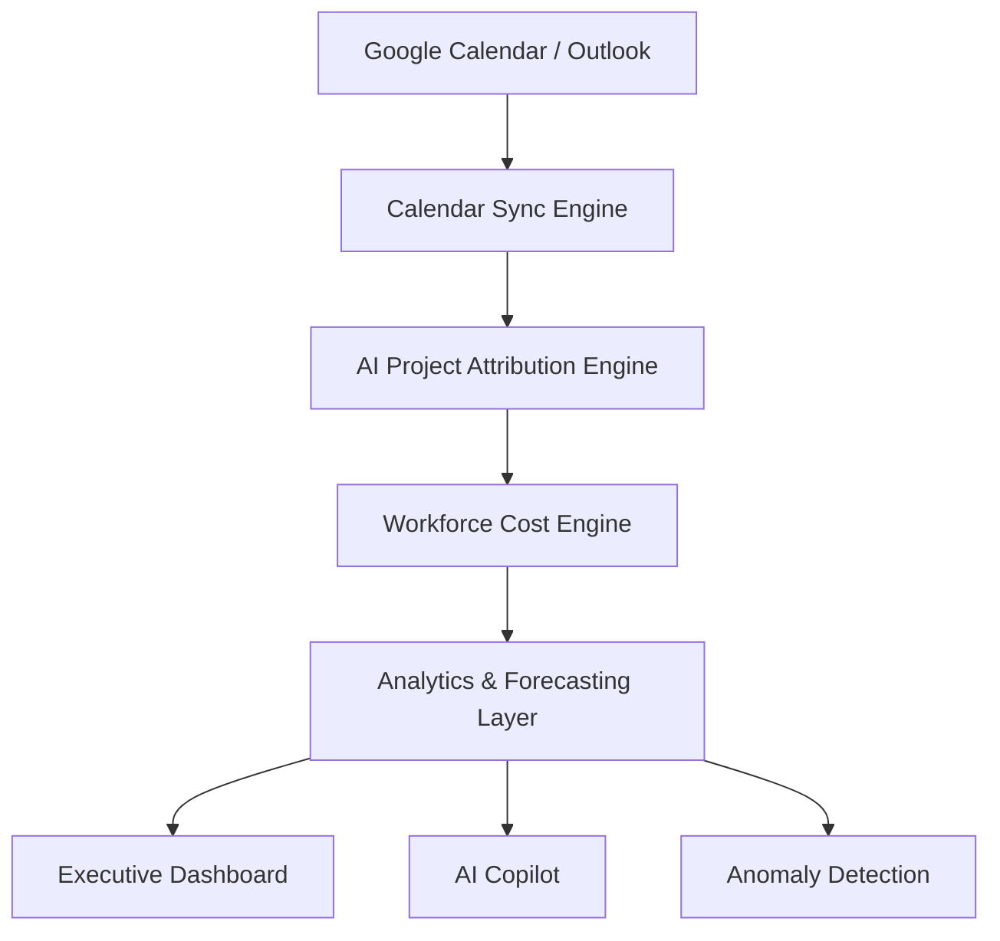

# 🚀 WorkPulse AI

> Transform Calendar Activity into Workforce Cost Intelligence

WorkPulse AI is an AI-powered HR Cost Intelligence Engine that automatically converts employee calendar activity into actionable workforce cost insights. By connecting organizational calendars, intelligently attributing meetings to projects, and calculating real-time HR expenditure, WorkPulse AI helps leaders understand exactly where time, effort, and budget are being invested.

---

## 📌 Problem Statement

Organizations spend millions on employee salaries every year, yet they often lack visibility into:

- Which projects consume the most workforce resources
- How meeting time translates into HR expenditure
- Which teams are over-utilized or under-utilized
- Why project budgets exceed expectations
- Where hidden productivity and cost leaks occur

Traditional timesheets are unreliable, while calendar data remains largely untapped.

WorkPulse AI bridges this gap by transforming meeting data into workforce intelligence.

---

## ✨ Features

### 📅 Calendar Integration
- Google Calendar Integration
- Microsoft Outlook Integration
- Automatic meeting synchronization
- Secure OAuth 2.0 authentication

### 🤖 AI-Powered Project Attribution
Automatically determines which project a meeting belongs to using:

- Meeting title
- Description
- Attendees
- Organizer information
- Recurrence patterns
- Historical meeting context

Each attribution includes a confidence score for transparency.

---

### 💰 Workforce Cost Intelligence
Maps employee roles and salary bands to hourly rates and calculates:

- Cost per meeting
- Cost per project
- Cost per department
- Cost per team
- Cost trends over time

---

### 📊 Executive Dashboard
Real-time analytics including:

- Total HR Spend
- Meeting Hours
- Project Cost Distribution
- Team Utilization
- Cost Trends
- Attribution Accuracy

---

### 🚨 AI Anomaly Detection
Detects:

- Budget overruns
- Meeting overload
- Cost spikes
- Unattributed meetings
- Resource allocation issues

---

### 🔮 Cost Forecasting
Predict future workforce expenditure using historical meeting patterns.

Examples:

- Project cost forecasting
- Team utilization forecasting
- Resource planning recommendations

---

### 🧠 AI Executive Copilot
Ask business questions in natural language.

#### Example Questions

```text
Why is Project Phoenix over budget?
```

```text
Which team has the highest meeting cost?
```

```text
Show the top 5 most expensive projects this month.
```

The AI Copilot generates executive-level insights instantly.

---

### 💡 Meeting Waste Detector

Identify unnecessary spending caused by:

- Excessive recurring meetings
- Large attendee counts
- Long-duration meetings
- Low-value meeting patterns

Receive actionable recommendations and estimated savings opportunities.

---

## 🏗️ Architecture



---

## 🎨 Design Philosophy

WorkPulse AI is inspired by modern enterprise SaaS products:

- Stripe
- Linear
- Ramp
- Rippling
- Notion

### Design Goals

- Executive-first experience
- Clean analytics-focused UI
- Premium enterprise aesthetics
- AI-native workflows
- High information density

---

## 🛠️ Tech Stack

### Frontend

- Next.js
- TypeScript
- Tailwind CSS
- Framer Motion
- Recharts

### Backend

- FastAPI
- Python

### AI Layer

- OpenAI
- LangChain

### Database

- PostgreSQL

### Authentication

- Google OAuth 2.0
- Microsoft OAuth

### Integrations

- Google Calendar API
- Microsoft Graph API

---

## 📈 Business Impact

WorkPulse AI helps organizations:

✅ Increase project cost visibility

✅ Reduce meeting waste

✅ Improve workforce allocation

✅ Detect budget overruns earlier

✅ Make data-driven resource decisions

✅ Eliminate manual timesheet dependency

---

## 🔒 Security & Privacy

- OAuth 2.0 Authentication
- Role-Based Access Control (RBAC)
- No individual salary exposure in shared dashboards
- Secure calendar synchronization
- Enterprise-grade access management

---

## 🏆 Innovation Beyond Requirements

Beyond the hackathon requirements, WorkPulse AI introduces:

- AI Executive Copilot
- Meeting Waste Detection
- Workforce Cost Forecasting
- What-If Cost Simulation
- AI-Powered Resource Optimization

These capabilities transform WorkPulse AI from a reporting tool into a workforce intelligence platform.

---

## 🚀 Future Roadmap

- Slack Integration
- Jira Integration
- Asana Integration
- Payroll System Integration
- Workforce Productivity Analytics
- AI Resource Allocation Recommendations
- Multi-Organization Support

---

## 📸 Screenshots

### Landing Page
_Add screenshot here_

### Dashboard Overview
_Add screenshot here_

### AI Attribution Engine
_Add screenshot here_

### Cost Analytics
_Add screenshot here_

### Executive Copilot
_Add screenshot here_

---

## 👨‍💻 Team

Built for **AI Hackathon 2025**

**WorkPulse AI** — Empowering organizations with workforce cost intelligence.

---

## 📄 License

MIT License

Copyright (c) 2025 WorkPulse AI
